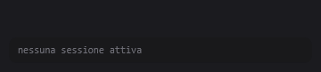

# Claude HUD

Un widget minuscolo, sempre in primo piano, che mostra tutte le sessioni di
Claude Code aperte sulla macchina: una riga per sessione, con il colore del
progetto, il nome della chat e un indicatore di stato.

*[English](README.md)*



Le sessioni compaiono man mano che partono. Un cerchio giallo vuol dire che la
sessione sta lavorando; diventa un quadrato verde a turno finito, e un rombo blu
quando aspetta che tu approvi qualcosa.

Niente barra del titolo, niente tab, niente icona nella barra delle
applicazioni. Sta in un angolo e cresce man mano che le sessioni vanno e vengono.

## Perché

Se tieni aperto Claude Code su più progetti insieme, perdi il conto di quale
sessione sta ancora lavorando, quale ha finito e — la peggiore — quale è ferma
in silenzio ad aspettare che tu approvi un permesso.

Claude HUD te lo dice a colpo d'occhio, e può suonare quando una sessione cambia
stato, così puoi guardare da un'altra parte.

## Requisiti

- **Windows** con PowerShell 5.1 (c'è di serie su Windows 10/11) — il widget usa WPF
- **Git Bash** — l'hook è uno script bash. Installa [Git per Windows](https://git-scm.com/download/win)
- **jq** — `winget install jqlang.jq`

Se `jq` manca, l'hook esce in silenzio senza scrivere niente. È voluto: un HUD
rotto non deve mai disturbare una sessione di Claude Code.

## Installazione con Claude Code

Un agente che sa farlo ce l'hai già. Incolla il prompt qui sotto in Claude Code
e ti esegue i passi manuali — con attenzione, perché è il prompt stesso a
dirgli come.

Leggilo prima di mandarlo. È volutamente esplicito sull'unico punto pericoloso:
il tuo `~/.claude/settings.json` contiene le tue configurazioni, e va **fuso**,
mai sovrascritto.

````text
Installa Claude HUD da https://github.com/jenz26/claude-hud su questa macchina.

Leggi prima il README del repository e seguilo. Prima di cominciare verifica
che Git Bash e jq siano disponibili. Se jq manca, fermati e dimmi come
installarlo invece di aggirare il problema.

Cosa fare:

1. Scarica claude-hud.sh e claude-hud-widget.ps1 dal repo e mettili in
   ~/.claude/
2. Registra i sette hook in ~/.claude/settings.json, usando il blocco JSON del
   README
3. Metti claude-hud.cmd sul mio Desktop
4. Dimmi come avviarlo e come verificare che funzioni

Regole per il passo 2, perche' quel file contiene le mie configurazioni:

- Fanne una copia in ~/.claude/settings.json.bak prima di toccarlo
- FONDI il blocco hooks, non sovrascrivere il file. Se esiste gia' una sezione
  "hooks" con altri eventi, aggiungi i miei accanto ai suoi e lascia tutto il
  resto esattamente com'e'. Se uno di questi sette eventi e' gia' collegato a
  qualcos'altro, fermati e chiedimi invece di indovinare
- Mostrami il diff prima di scrivere
- Verifica il risultato con: jq . ~/.claude/settings.json
  Se non e' JSON valido, Claude Code scarta l'intero file in silenzio e non
  funziona niente
- Nei comandi degli hook usa "$HOME", non "${CLAUDE_PROJECT_DIR}". Questi hook
  sono globali e devono scattare in qualunque cartella, mentre
  CLAUDE_PROJECT_DIR punterebbe al progetto aperto in quel momento

Se qualcosa nella mia installazione non e' come il README si aspetta, fermati e
chiedimi invece di indovinare.
````

Se preferisci farlo a mano, gli stessi passi sono qui sotto.

## Installazione a mano

Quattro passi. Il secondo modifica un file che può già contenere tue
configurazioni, quindi leggilo prima di incollare.

### 1. Copia gli script

```bash
cp claude-hud.sh claude-hud-widget.ps1 ~/.claude/
```

### 2. Registra gli hook

Apri `~/.claude/settings.json` e **fondi** il blocco `hooks` qui sotto.

> **Fondi, non sovrascrivere.** In quel file ci sono le tue impostazioni di
> Claude Code. Se c'è già una sezione `hooks` con altri eventi, aggiungi questi
> accanto ai suoi, non al posto. Fai prima una copia:
> `cp ~/.claude/settings.json ~/.claude/settings.json.bak`

```json
{
  "hooks": {
    "SessionStart":     [ { "hooks": [ { "type": "command", "shell": "bash", "async": true, "command": "bash \"$HOME/.claude/claude-hud.sh\" event" } ] } ],
    "UserPromptSubmit": [ { "hooks": [ { "type": "command", "shell": "bash", "async": true, "command": "bash \"$HOME/.claude/claude-hud.sh\" event" } ] } ],
    "PostToolUse":      [ { "hooks": [ { "type": "command", "shell": "bash", "async": true, "command": "bash \"$HOME/.claude/claude-hud.sh\" event" } ] } ],
    "Stop":             [ { "hooks": [ { "type": "command", "shell": "bash", "async": true, "command": "bash \"$HOME/.claude/claude-hud.sh\" event" } ] } ],
    "StopFailure":      [ { "hooks": [ { "type": "command", "shell": "bash", "async": true, "command": "bash \"$HOME/.claude/claude-hud.sh\" event" } ] } ],
    "SessionEnd":       [ { "hooks": [ { "type": "command", "shell": "bash", "async": true, "command": "bash \"$HOME/.claude/claude-hud.sh\" event" } ] } ],
    "Notification":     [ { "matcher": "permission_prompt|idle_prompt|agent_needs_input",
                            "hooks": [ { "type": "command", "shell": "bash", "async": true, "command": "bash \"$HOME/.claude/claude-hud.sh\" event" } ] } ]
  }
}
```

Poi controlla di non aver rotto il file:

```bash
jq . ~/.claude/settings.json
```

Se stampa un errore, Claude Code scarta l'intero file in silenzio e non
funzionerà niente. Sistemalo prima di andare avanti.

**Perché `$HOME` e non `${CLAUDE_PROJECT_DIR}`?** Questi hook sono globali,
scattano in qualunque cartella apri Claude Code. `${CLAUDE_PROJECT_DIR}`
punterebbe al progetto corrente, che è il posto sbagliato. `$HOME` lo espande
bash, che è la shell dichiarata nell'hook stesso.

### 3. Metti il lanciatore sul Desktop

Copia `claude-hud.cmd` sul Desktop. Rinominalo pure: `Claude HUD.cmd` sta meglio
sotto un'icona.

Serve un `.cmd` perché un `.ps1` col doppio click si apre nell'editor invece di
eseguirsi. Il lanciatore passa anche `-ExecutionPolicy Bypass`, così funziona
qualunque sia la policy della macchina, e `-WindowStyle Hidden`, così non resta
una finestra nera aperta.

### 4. Avvialo

Doppio click sul lanciatore. Apri Claude Code da qualche parte e manda un
prompt: deve comparire una riga.

Non parte da solo al login. Se lo vuoi, metti un collegamento al lanciatore in
`shell:startup`.

## Uso

| Gesto | Effetto |
|---|---|
| Trascina col tasto sinistro | Sposta la finestra — resta dove la metti |
| Tasto destro | Apre un menù con **Close** |

Non c'è barra del titolo, quindi non ci sono i soliti pulsanti: questi due gesti
li sostituiscono.

Se lo lanci due volte, la seconda istanza esce da sola: un mutex lo tiene a una.

Se lo sposti trascinandolo, **resta dove l'hai messo**, e continua a crescere
allontanandosi dal bordo su cui l'hai lasciato.

Il widget di proposito **non** cancella i file di stato all'avvio. Le sessioni
morte le toglie comunque la regola dei 30 minuti al primo giro, mentre
cancellare subito farebbe sparire proprio quelle che contano: solo `running`
viene rinfrescato dall'heartbeat di `PostToolUse`, mentre `done`, `idle` e
`waiting` nascono da eventi che scattano una volta sola. Una sessione ferma su
una richiesta di permesso non manda più niente finché non rispondi, quindi
cancellarne il file la nasconderebbe per sempre.

## L'indicatore di stato

L'indicatore a destra dice lo stato due volte, con la **forma** e col colore:

| Forma | Colore | Stato |
|---|---|---|
| Cerchio | Giallo | Turno in corso |
| Quadrato | Verde | Turno concluso |
| Triangolo | Rosso | Errore |
| Rombo | Blu | Aspetta un permesso o un input |
| Puntino | Grigio | Ferma, oppure zitta da più di 5 minuti |

Cerchio e quadrato sono la metafora di play e stop: tondo vuol dire che gira,
squadrato che si è fermato. Il triangolo è l'unica forma appuntita, perché un
errore è la cosa che non deve mai essere scambiata per qualcos'altro.

Il colore da solo non basterebbe. Circa un uomo su dodici ha una qualche forma
di discromatopsia, e verde/rosso è proprio l'asse che collassa — cioè la coppia
che qui significa "concluso" ed "errore". Con forme diverse il colore diventa
rinforzo invece che unico segnale.

La barretta colorata a sinistra è il colore **Peacock** del progetto, letto dal
suo `.vscode/settings.json` (`peacock.color` o `titleBar.activeBackground`). Se
il progetto non ne ha uno la barretta è grigia: non è un guasto.

Dopo 30 minuti di silenzio il file di stato viene cancellato e la riga sparisce.
Serve perché chiudendo l'editor di netto l'evento `SessionEnd` non scatta mai.

## Segnali acustici

Il widget suona quando una sessione **cambia stato**, così ti accorgi che ha
finito senza guardare:

| Passaggio | Suono predefinito |
|---|---|
| Turno concluso | `Asterisk` |
| Aspetta un permesso o un input | `Question` |
| Errore | `Hand` |

Le regole:

- Suona **solo al passaggio**, non finché lo stato resta lo stesso. Una sessione
  ferma su "concluso" non suona ogni secondo.
- **Mai alla prima comparsa** di una sessione, così riavviando il widget non
  parte una raffica per quelle già aperte.
- **Un solo suono per giro** anche se più sessioni cambiano insieme; vince
  quello che chiede più attenzione (errore, poi attesa, poi concluso).
- Niente quando una sessione sparisce.

Ogni voce accetta un suono di Windows (`Asterisk`, `Beep`, `Exclamation`,
`Hand`, `Question`), il percorso di un `.wav`, oppure `''` per il silenzio:

```powershell
$SoundDone    = ''                            # muto
$SoundWaiting = 'C:\Windows\Media\chimes.wav'
```

I suoni di sistema seguono volume e schema audio di Windows, quindi si zittiscono
anche dal mixer. In `C:\Windows\Media` ci sono `ding.wav`, `chimes.wav`,
`notify.wav` e le serie `Alarm01..10` e `Ring01..10`.

## Taratura

In testa a `claude-hud-widget.ps1`:

```powershell
$Anchor    = 'BottomRight'   # TopLeft | TopRight | BottomLeft | BottomRight
$MarginX   = 16              # distanza dal bordo verticale dello schermo
$MarginY   = 16              # distanza dal bordo orizzontale dello schermo
$Width     = 340             # larghezza; l'altezza segue il numero di righe
$FontSize  = 11
$ProjWidth = 96              # larghezza della colonna del progetto
$BackAlpha = 220             # 0 trasparente, 255 opaco

$SoundDone    = 'Asterisk'
$SoundWaiting = 'Question'
$SoundError   = 'Hand'
```

La finestra è ancorata a un angolo e cresce nella direzione opposta, quindi
l'angolo resta fermo qualunque sia il numero di sessioni.

Con `$Width = 340` la colonna del titolo tiene circa 28 caratteri e i nomi chat
vengono troncati. Alza a 420-460 se dà fastidio.

Dopo ogni modifica va chiuso e riaperto il widget.

## Come funziona

Tre pezzi indipendenti che si parlano attraverso file:

```
Claude Code --(evento)--> claude-hud.sh --(scrive)--> ~/.claude/hud/<session-id>
                                                              │
                                        claude-hud-widget.ps1 (legge ogni secondo)
                                                              │
                                                         finestra a schermo
```

L'hook scrive anche se il widget è spento, e il widget disegna qualunque cosa
trovi. Non si conoscono.

`PostToolUse` serve solo da battito: tiene fresco il timestamp perché una
sessione al lavoro non viri a grigio.

### Formato dei file di stato

Un file per sessione in `~/.claude/hud/`, il nome è la session id. Una riga
sola, cinque campi separati da `|`:

```
stato|timestamp|colore|progetto|titolo
```

```
running|1719421234|#61dafb|mia-api|Refactor middleware autenticazione
```

La scrittura è atomica — file temporaneo più `mv` — così il widget non può mai
leggere una riga a metà.

### Nome della chat

Il titolo è il **nome della chat** generato da Claude Code, letto dal transcript
della sessione in `~/.claude/projects/<progetto>/<session-id>.jsonl`, che
contiene righe così:

```json
{"type":"ai-title","aiTitle":"Refactor middleware autenticazione","sessionId":"..."}
```

Se non è ancora disponibile, il widget ripiega sull'ultimo prompt; mancando
entrambi mostra `(new session)`. Le stringhe a video sono in inglese, i commenti
nel codice in italiano.

### Modalità da terminale

`claude-hud.sh` accetta tre comandi:

| Comando | Effetto |
|---|---|
| `bash ~/.claude/claude-hud.sh event` | Letto dagli hook, riceve il JSON su stdin |
| `bash ~/.claude/claude-hud.sh once` | Disegna una volta e esce |
| `bash ~/.claude/claude-hud.sh watch` | Ridisegna nel terminale ogni secondo |

`once` e `watch` sono l'HUD a caratteri originale, da prima che esistesse il
widget. Restano comodi per controllare lo stato da un terminale.

## Se qualcosa non funziona

**Non compare nessuna riga.** In ordine:

1. `ls ~/.claude/hud/` — nasce un file quando apri una sessione? Se no, gli hook
   non scattano.
2. `/hooks` dentro Claude Code — i sette eventi sono elencati? Se no,
   `~/.claude/settings.json` non viene letto. Quasi sempre è JSON non valido, che
   Claude Code scarta in silenzio. Verifica con `jq . ~/.claude/settings.json`.
3. Se i file nascono ma la finestra è vuota, il problema è nel widget. Chiudilo e
   lancialo da un terminale con `powershell -File ~/.claude/claude-hud-widget.ps1`
   per vedere gli errori.

**Gli hook sono registrati ma non nasce nessun file.** Quasi sempre è `jq` non
trovato. Prova l'hook a mano:

```bash
echo '{"hook_event_name":"SessionStart","session_id":"test1","cwd":"C:/qualche/progetto"}' \
  | bash ~/.claude/claude-hud.sh event
cat ~/.claude/hud/test1
```

Attenzione a come scrivi il payload di prova: i backslash di Windows vanno
raddoppiati. `C:\Users` non è JSON valido — `\U` non è una sequenza di escape
ammessa — quindi jq rifiuta tutto e l'hook esce in silenzio. Usa `/`.

Per forzare un jq preciso: `HUD_JQ=/percorso/di/jq`.

**Due righe per lo stesso progetto.** Di solito sono due sessioni davvero aperte
su quella cartella: il file di stato ha per nome la session id, quindi due eventi
della stessa sessione riscrivono lo stesso file e non possono produrre due righe.
L'altro caso è una sessione chiusa male: la riga diventa grigia dopo 5 minuti e
sparisce dopo 30. Per non aspettare: `rm ~/.claude/hud/<session-id>`.

**Il progetto mostrato è sbagliato.** Lo script risale da `cwd` cercando la prima
cartella con `.vscode` o `.git`. Se non ne trova, usa la cartella stessa.

## Note per chi mette le mani nel codice

**`bash` sul PATH non è Git Bash.** Su Windows `where bash.exe` risponde
`C:\Windows\System32\bash.exe`, che è quello di WSL. Uno script che lancia bash
deve usare il percorso completo `C:\Program Files\Git\bin\bash.exe`, altrimenti
parte Ubuntu e non trova niente.

**Non leggere i transcript con `Get-Content -Tail`.** I file in
`~/.claude/projects/` arrivano a decine di MB, ma il problema non è la
dimensione: ogni riga è un evento JSON che con allegati e output di tool pesa
decine di KB. In un transcript reale l'ultimo megabyte conteneva 51 righe, e
`-Tail 120` bloccava per minuti. Il widget legge una finestra fissa di byte dal
fondo (`$TailBytes`, 1 MB), così il costo non dipende dalla lunghezza delle
righe: circa 2,7 ms per lettura quando il file è nella cache del sistema, e
rilegge solo se il transcript cambia. Ridurre la finestra a 64 KB risparmia
circa 1,5 ms e in cambio rischia di mancare il titolo quando in coda c'è un
allegato grosso: non conviene.

**Il widget salta il ridisegno se niente è cambiato**, confrontando una firma
delle righe con quella del giro precedente. Ricostruire l'interfaccia ogni
secondo costava il 4% di un core a schermo fermo; così è circa l'1%.

**Chiama `UpdateLayout()` prima di riposizionare.** Subito dopo aver sostituito
le righe, `ActualHeight` è ancora quella vecchia, e con l'ancoraggio in basso la
finestra si stacca dall'angolo. C'è anche un aggancio a `SizeChanged` come rete
di sicurezza.

**Il `$mutex` sembra inutilizzato e gli analizzatori lo segnalano.** Va tenuto:
se il garbage collector raccoglie il Mutex, il blocco a istanza singola cade.

**Nello script bash i padding non usano `%-*s`.** Bash conta i byte, non i
caratteri, e le lettere accentate sfaserebbero la colonna dei pallini. Per lo
stesso motivo lo script imposta `LC_ALL`.

## Licenza

MIT — vedi [LICENSE](LICENSE).
